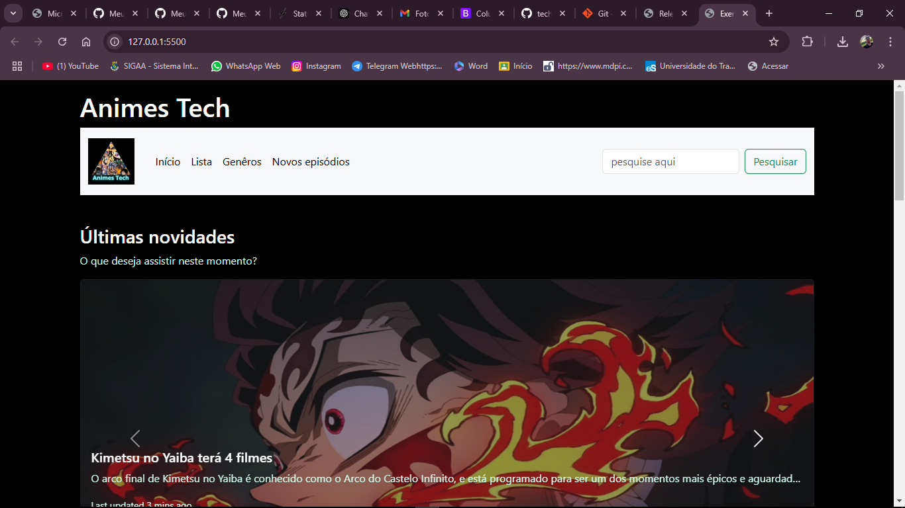
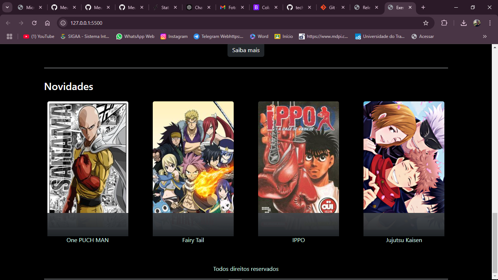
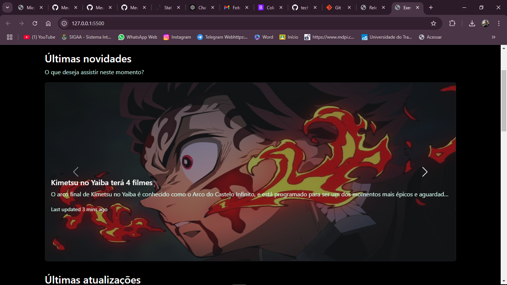
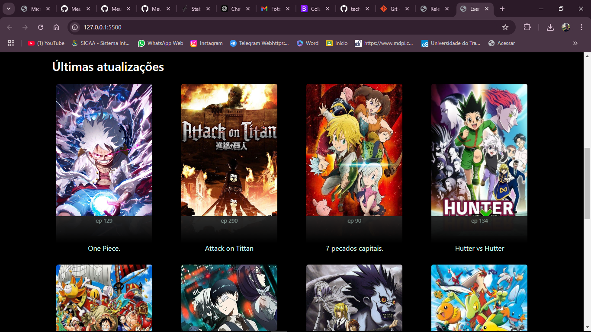
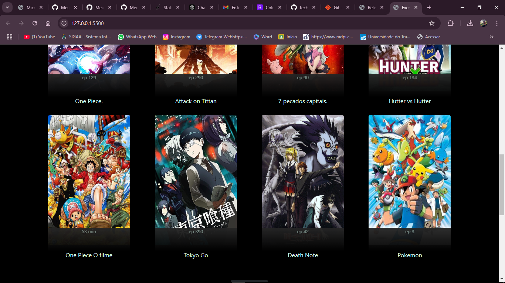
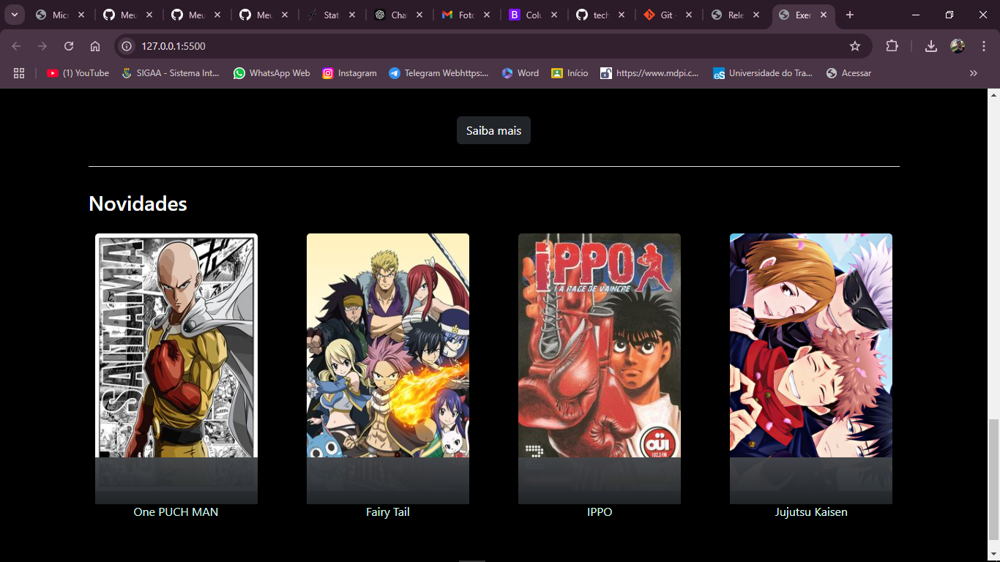

# techSiteAnime
Basicamente eu tentei fazer um cópia do site 2 mas apenas a inferface inicial. O porgrama mostra um catálogo de animes e filme de animes. Eu utilizei bootsrap na estilização e um pouco de css no arquivo index.css porém também utilizei style="" diretamente em vários moomentos.

